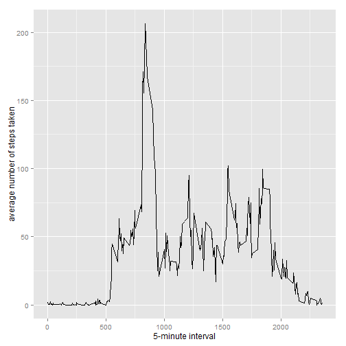
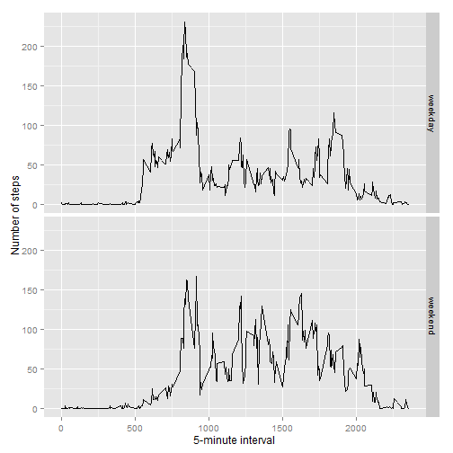

# Import dataset

```r
URL<-"https://d396qusza40orc.cloudfront.net/repdata%2Fdata%2Factivity.zip"
library(downloader) #for https
download(URL,"tmp.zip") #download
unzip("tmp.zip") #unzip
activity<-read.csv("activity.csv") 
```

# Total steps by day

```r
total.steps <- tapply(activity$steps, activity$date, FUN=sum, na.rm=TRUE)
hist(total.steps,breaks=8)
```

 

```r
library(ggplot2)
qplot(total.steps, binwidth=1000, xlab="total number of steps taken each day")
```

 

# Average Steps

```r
mean(total.steps, na.rm=TRUE)
```

```
## [1] 9354.23
```

```r
median(total.steps, na.rm=TRUE)
```

```
## [1] 10395
```

```r
ave.steps <- aggregate(x=list(steps=activity$steps), by=list(interval=activity$interval),FUN=mean, na.rm=TRUE)
ggplot(data=ave.steps, aes(x=interval, y=steps)) +
  geom_line() +
  xlab("5-minute interval") +
  ylab("average number of steps taken")
```

 


The period with highest average number of steps is:

```r
ave.steps[which.max(ave.steps$steps),]
```

```
##     interval    steps
## 104      835 206.1698
```

# Deal with NAs

```r
na.steps <- is.na(activity$steps)

table(na.steps)
```

```
## na.steps
## FALSE  TRUE 
## 15264  2304
```

```r
na.replace <- function(steps, interval) {
  filled <- NA
  if (!is.na(steps))
    filled <- c(steps)
  else
    filled <- (ave.steps[ave.steps$interval==interval, "steps"])
  return(filled)
}
imputed.steps <- activity
imputed.steps$steps <- mapply(na.replace, imputed.steps$steps, imputed.steps$interval)
```

And comparing with no replacement with NAs, we see in particular a reduction in days with very low number of steps - days with many NAs will tend towards the average due to the imputation used.


```r
total.steps <- tapply(imputed.steps$steps, imputed.steps$date, FUN=sum)
qplot(total.steps, binwidth=1000, xlab="total number of steps taken each day, NAs imputed")
```

 

```r
mean(total.steps)
```

```
## [1] 10766.19
```

```r
median(total.steps)
```

```
## [1] 10766.19
```

# Investigating weekends
Here, days of the week are classified as weekday or weeked, then these differrent types of day are compared.

```r
dayStatus <- function(date) {
  day <- weekdays(date)
  if (day %in% c("Monday", "Tuesday", "Wednesday", "Thursday", "Friday"))
    return("weekday")
  else if (day %in% c("Saturday", "Sunday"))
    return("weekend")
  else
    stop("invalid date")
}
imputed.steps$date <- as.Date(imputed.steps$date)
imputed.steps$day <- sapply(imputed.steps$date, FUN=dayStatus)

ave.steps <- aggregate(steps ~ interval + day, data=imputed.steps, mean)
ggplot(ave.steps, aes(interval, steps)) + geom_line() + facet_grid(day ~ .) + xlab("5-minute interval") + ylab("Number of steps")
```

 

Weekends show a more consistend trace though the day, while weekdays have a higher, morning peak.
